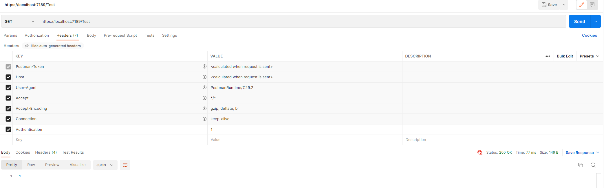

# C# Web API Customize Authentication

**Table of Contents**

- [Introduction](#introduction)
- [Preparation](#Preparation)
- [Implement Authentication Handler](#implement-authentication-handler)
- [Test](#test)

# Introduction

This article will introduce how we customize the most basic authentication process in a .NET WEB API project.

# Preparation

1. Create a Web API project in Visual Studio.

2. Install `Microsoft.AspNetCore.Authentication` in **Package Manager Console** using the following command:

    ```
    Install-Package Microsoft.AspNetCore.Authentication
    ```

# Implement Authentication Handler

## 1. Create a class that inherite from `AuthenticationHandler`
```C#
using Microsoft.AspNetCore.Authentication;
using Microsoft.Extensions.Options;
using System.Text.Encodings.Web;

namespace JWTProject.Authentication
{
    /*
    In this case we will keep everything simple, so we will use default AuthenticationSchemeOptions
        */
    public class MyAuthenticationHandler : AuthenticationHandler<AuthenticationSchemeOptions>
    {
        // Scheme of the Authentication
        public const string Scheme = "MyScheme";

        // Constructor Auto Generated
        public MyAuthenticationHandler(IOptionsMonitor<AuthenticationSchemeOptions> options, ILoggerFactory logger, UrlEncoder encoder, ISystemClock clock) : base(options, logger, encoder, clock)
        {
        }

        // This method is where we should implement Authentication Logic
        protected override Task<AuthenticateResult> HandleAuthenticateAsync()
        {
        }
    }
}
```
## 2. Implement method `HandleAuthenticateAsync`
How to implement authentication should vary according to the authentication method. 

We use very simple logic here: Verify if `Authentication` is included in the request header.

```C#

// This method is where we should implement Authentication Logic
protected override Task<AuthenticateResult> HandleAuthenticateAsync()
{
    if (!Request.Headers.ContainsKey("Authentication"))
        return Task.FromResult(AuthenticateResult.Fail("No Authentication In header"));

    ClaimsPrincipal principal = new ClaimsPrincipal();
    return Task.FromResult(AuthenticateResult.Success(new AuthenticationTicket(principal ,Scheme)));
}
```

## 3. Add authentication and use authentication middleware

**With our Authentication Handler Implemented, now we need to add it Web API container and enable it.**

In your `Program.cs`

1. add authentication to Web API container:
    ```C#
    builder.Services.AddAuthentication(options =>{
        // makes controller to use our sheme as default
        options.DefaultChallengeScheme = MyAuthenticationHandler.Scheme;
    }).AddScheme<AuthenticationSchemeOptions, MyAuthenticationHandler>(MyAuthenticationHandler.Scheme, options => {});
    ```
    This line of code should be inserted before `builder.Build()`

2. Use authentication middleware:

    ```C#
    app.UseAuthentication();
    ```

    **Very Important:**
    
    This line of code should be inserted after `app.UseHttpsRedirection()` and before `app.UseAuthorization()`.


**My Program.cs looks like this**

```C#
using JWTProject.Authentication;
using Microsoft.AspNetCore.Authentication;

var builder = WebApplication.CreateBuilder(args);

// Add services to the container.

builder.Services.AddControllers();
// Learn more about configuring Swagger/OpenAPI at https://aka.ms/aspnetcore/swashbuckle
builder.Services.AddEndpointsApiExplorer();
builder.Services.AddSwaggerGen();

builder.Services.AddAuthentication(options =>{
    options.DefaultChallengeScheme = MyAuthenticationHandler.Scheme;
}).AddScheme<AuthenticationSchemeOptions, MyAuthenticationHandler>(MyAuthenticationHandler.Scheme, options => {});

var app = builder.Build();

// Configure the HTTP request pipeline.
if (app.Environment.IsDevelopment())
{
    app.UseSwagger();
    app.UseSwaggerUI();
}

app.UseHttpsRedirection();

app.UseAuthentication();

app.UseAuthorization();

app.MapControllers();

app.Run();
```
# Test

## Create Controller for testing
```C#
using Microsoft.AspNetCore.Authorization;
using Microsoft.AspNetCore.Mvc;

namespace JWTProject.Controllers
{
    [ApiController]
    [Route("[controller]")]
    [Authorize(AuthenticationSchemes = MyAuthenticationHandler.Scheme)]
    public class TestController : ControllerBase
    {

        [HttpGet]
        public int AuthenticationTest()
        {
            return 1;
        }

    }
}
```

Make sure to add attribute `Authorize(AuthenticationSchemes = MyAuthenticationHandler.Scheme)` on the Class.

## Test with Postman

### Without Authentication in Header.


We get response 401 as we expected

### With Authentication in Header.


Seems we passed the authentication, however 403 means we are not authorized.

This is because the default authorization system of Web API will check `ClaimsIdentiy.IsAuthenticated`. However, in our `AuthenticationHandler` we didn't set `ClaimsIdentiy` for `ClaimsPrincipal`

In order to pass the authorization system we need to modify our `HandleAuthenticateAsync` method:

```C#
protected override Task<AuthenticateResult> HandleAuthenticateAsync()
{
    if (!Request.Headers.ContainsKey("Authentication"))
        return Task.FromResult(AuthenticateResult.Fail("No Authentication In header"));

    //when create ClaimsIdentity, if we want identiy.IsAuthenticated to be true. a non-empty string is required to pass into the constructor
    ClaimsIdentity identity = new ClaimsIdentity("Anystring");
    ClaimsPrincipal principal = new ClaimsPrincipal(identity);
    return Task.FromResult(AuthenticateResult.Success(new AuthenticationTicket(principal ,Scheme)));
}
```

Let's try to request the API again



We are getting what we expected.
